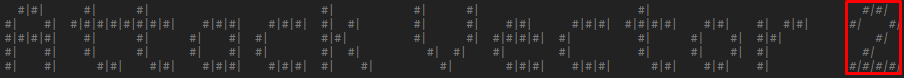

# GM Login
How to log in as a game master depends on how login is set up in general. If Google login is used, your Google linked account could be set up as a GM account, and you can just log in with that.

## Generic login

There is also a generic login for all accounts that you can use as a GM.
On the login page, if you click the `2` of `Attack Vector 2`, you will go to the Admin login page.

There is a single password that you can use to log in as any user. This can be used to log into your game master account. The person that set up Attack Vector has created the password.

## GM logging in as a player
The generic login page can also be used to log in as a player. This might be useful in some special circumstances, but note that any player/hacker account can only have a single active login session. So if a player is logged in, and you log in as them, they will be logged out.