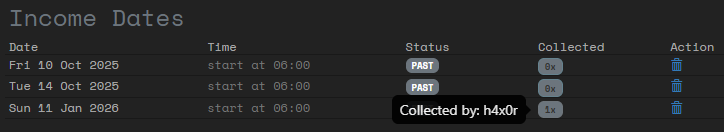

# Managing script credits
If your game uses script credits, then you, as a game master, have to manage how many credits the players have access to.

Sources of script credits:
- Credit income
- Selling data
- Receive from NPCs

## Credits income
When giving a player the 'script credits', you can also configure the credits income of the player. This income can be collected by the player on 'income dates'. These are usually days that the Larp runs.

Configure the income days by going to the **Scripts** page and then to **Script income dates**. Here you can add dates or date-ranges. You can also see how many times the income was collected. Hover over the collected count to see which players have collected income on that date.

Once a date is past, you cannot re-open it for players. If players did not collect their income for a day, but you want to give them the credits, then transfer it to them, using the same method as will be used for rewards from NCPs, see [here](#receive-from-npcs).

## Selling data
You can add 'Credits source' layers to a site. These layers contain data that will be automatically sold for script credits. So basically you have them find credits while hacking sites.

Once the data is stolen, it's marked as such and can never be stolen again by other hackers. If you steal the data while testing your own site, you have to manually change the status back so it can be stolen again.

## Receive from NPCs
Players can receive credits from NPCs. You can create an NPC account, manually give that account credits and then have that account transfer credits to the player. This way the transaction history of the player will show from whom the credits came.

You can also directly transfer credits to a player account. Go to the **Scripts** page and then to **Hacker credits**. Here you can select a player and send them credits or remove credits from them. This will show up in their transaction history where the sender/receiver will be (system).
