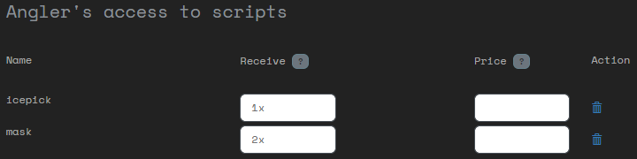
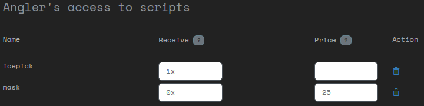

# Script access
You can give players access to scripts in the following ways:

- Grant them a daily allowance of scripts
- Allow them to buy scripts from the market
- Receiving scripts from NPCs
- Manually give them scripts

## Daily scripts
Go to the **Scripts** page and then to the **Script access** page. Here you can select a player and assign it scripts. Then set the number of scripts they receive each day in the receive field.

Players can claim these scripts as described [here](/player/scripts/Daily%20scripts).

## Script market
On the same screen you can also assign a price to a script. This is the number of script credits a player will have to pay for this script.

A player will only be able to buy the scripts configured here, for the prices list here. The market in Attack Vector is not a communal market, but purchase offers made to each player individually.

## Receiving script from NPC
You can have NPC vendors in your world that sell scripts to players or give them in return for favors. Use the script transfer mechanism for this, as explained [here](/player/scripts/Transferring%20scripts). You will have to first give the scripts to the NPC in one of the other ways listed here.

## Manually giving scripts
Go to the **Scripts** page and then to the **Current scripts** page. Here you can manage the exact scripts a player has. You can add or remove any scripts.
