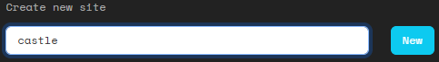
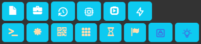
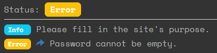

# Creating sites
From the home page you can create a new site. This will open up a new browser tab with the visual editor.

## Editor

In the editor you can:
- Add nodes to the site
- Connect nodes
- Move nodes around
- Edit the layers that are in a node
- Edit site properties
- View the status of the site

## Adding nodes
Drag a node with the image you like to the map.

The node image has no effect on the game, other than to signal information to the player. You decide what each image means.

In game, a node will be white if there is no ICE, or if all ICE is hacked. A node will be metallic if there is active ICE.

The editor does not automatically change the 'color' of the node. If you add an ICE layer to a node, and want to update the colors, refresh the browser (F5).

To remove a node, click on it to select it and press the button "Delete node".

## Connecting nodes
Click on one node to select it. Then hold CTRL and click on another node to create a connection.

To remove connections, select a node and click the button "Delete Lines".

## Move nodes around
Click and drag a node to change its position.

The "Snap" button will snap all nodes to a grid position.

The "Center" button will move the entire site to the center of the map.

## Edit layers
Click on a node to select it. This will show the current layer in the side frame:

A new node will always have an OS layer, which is represented by the house symbol.

You can add new layers by clicking on the layers panel. Layers are described [here](../../player/Layers).

To learn what each layer symbol is, just click it to add it to a node. You can easily remove them by clicking the thrash icon.

You can configure the properties of each layer. Hover over the ` ? ` to learn more about property.

## Site properties
The **name** of the site is what you give to hackers, so they can start to hack your site.

The **purpose** is optional, it can help you keep track of which story or plot this site is for.

The **owner** is the user that created it. For a GM this is not vitally important, but players can also create sites. Players can only edit sites they own.

The **start node** defines what is the node the players will connect to from the outside.

## Site status

Here you can see if there are any errors or warnings. A site that has errors cannot be hacked by players. Click on the blue arrow to jump to the problem.