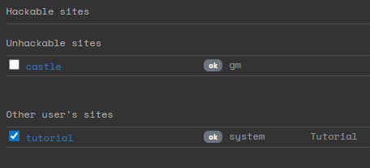
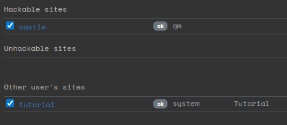

# Making a site hackable
When you create a site, it will start out as unhackable. This is to prevent players from hacking the site before you are ready.

*Here you see that the site "Castle"is currently not hackable.*

Click on the checkbox next to the name of the site to toggle if it can be hacked.

