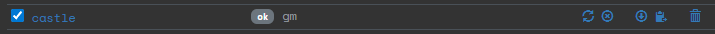

# Managing sites
From the **Sites** page, you see a number of options next to a site:

Hover over the icons to see what the action is.

## Actions

| Action          | Description                                                                                                                                                                                                |
| --------------- | ---------------------------------------------------------------------------------------------------------------------------------------------------------------------------------------------------------- |
| Reset site      | Eject all players from the site. Unhack all ICE and reset the puzzles. Stop all timers.                                                                                                                    |
| Delete all runs | As "Reset site" and also remove all run links from all players. This is useful to clean up after a Larp. Also: if you ever want to alter a site after the players have started hacking it, use this first. |
| Download        | Download the site as a JSON file. Use this before deleting a site to archive it. Can also be used to exchange sites between organizations.                                                                 |
| Make a copy     | Creates a copy of the site.                                                                                                                                                                                |
| Delete site     | Deletes the site from Attack Vector.                                                                                                                                                                       |

## Export (download) and import
Sites can be exported / downloaded as JSON files. These files can later be imported. The purpose of this is to have a backup of a site outside of Attack Vector. This can also be used to archive a site before deleting it.

## Editing JSON site files
Don't. do. this.

There are a lot of internal references inside the JSON file, so just changing a few IDs will probably cause a corrupted site to be created that will cause all kinds of errors in the future. It will be hard to remove such a corrupt site from the system.

