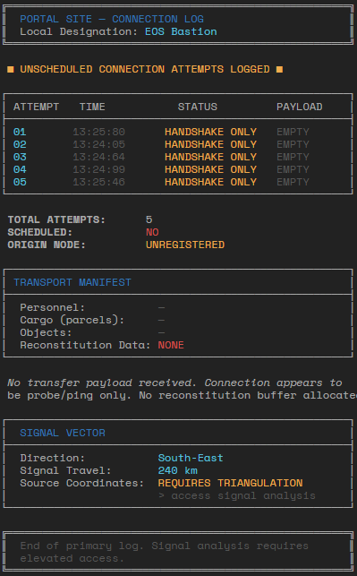
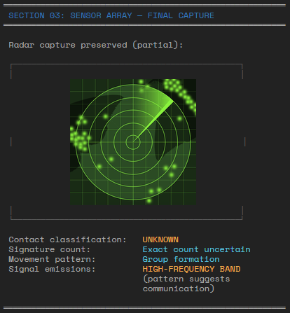

# Advanced formatted text
Combining the options of formatting text with unicode characters, you can create very nice results like this:



## LLM support
Hand crafting these can be cumbersome, but luckily LLMs are quite decent at producing these for you. The following can be used as part of a prompt to explain to an LLM how to format text:

```
My system displays text on a dark theme, default color is light grey. The line length is 80 characters. Full unicode is supported, so graphics like borders can be approximated with this. It uses the following tags to add formatting or styling to text: [primary]blue[/] [pri]blue[/] [ok]green[/] [info]light blue[/] [warn]orange[/] [error]red[/] [mute]dark gray[/] [b]bold[/] [i]italics[/] [s]strikethrough[/] [u]underline[/] [us]underline strikethrough[/] These tags cannot be nested, so this does not work [u][ok]text[/], as each new styling resets all previous stylings.
```

## Aligning borders
When using borders, it can be a bit tricky to get the borders right. LLMs typically will not get this perfect, so you will have to do some cleanup.

```
┌─────┐           ┌─────┐           
|text   │   ->    |text │
└─────┘           └─────┘
```

It won't always be perfect, as the characters used to make boxes are not mono-spaced. There is the Unicode 'Thin SPace' (U+2009) that you could use if you want to tweak this.

## Examples
Here are some more examples of texts used in the Frontier Larp.

### Example with minor formatting


### Example with picture



