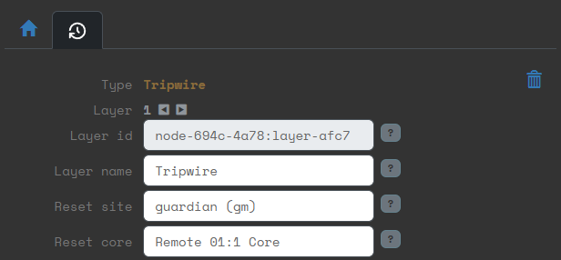

# Remote reset tripwires
A tripwire timer can be stopped by hacking the connected core layer. This core layer does not need to be in the same site as the tripwire. This way you can set up a network of sites that need to be hacked by multiple players in overcome the timers.

*Example of a tripwire with a core in the remote site "guardian"* owned by account "gm".

Note that hacking a core will reveal to the players the name of the site and the node that contains the core needed to reset it. If you don't want the players to find this, put ICE layers above the tripwire layer.

---

For contrast, this is what a normal connection to a core in the same site looks like:

