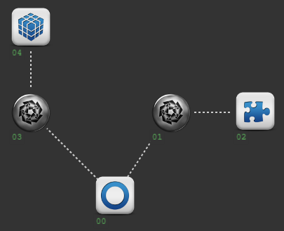

# Passwords and keystores
Another kind of puzzle you can add to a site is having the players find passwords.

There are two kinds of password in Attack Vector:
- static passwords
- temporary passwords

## Password ICE
Static passwords are passwords that never change. They are used to bypass Password ICE. It's up to you as game master to hide the password somewhere.

Passwords can be hidden inside the site, for example the name of a pet that can be found in a text layer somewhere else in the site. But passwords can also be hidden in the real world, forcing hackers to go outside of Attack Vector.

Password ICE has an optional hint that can push players in the right direction. The hint will be shown after the 3rd failed attempt.

## Keystore passwords
All ICE can have a temporary password. With this temporary password, the ICE can be bypassed without having the hack it.

Temporary passwords are stored in **keystore** layers. When a player hacks a keystore layer, they receive the password. Temporary passwords look like this:

`Gaanth/7n-43-6f-3a/3u-54-4u-1t/`

The first part of this password indicates what type of ICE its for (Gaanth = Tangle). The rest is random.

Temporary passwords can be entered in ICE with the `password` command. This opens the password UI for an ICE layer.

Temporary passwords change every time the site is reset.

## Sample keystore setup
A very simple setup using a keystore:

- Node 00 - entry
- Node 01 - ICE 1
- Node 02 - keystore for ICE 2
- Node 03 - ICE 2
- Node 04 - the thing players want to hack

Players now have a choice: hack ICE 1 and retrieve the temporary password for ICE 2, or directly hack ICE 2. If ICE 2 has a higher strength, then hacking ICE 1 is the better choice.
