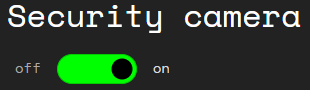
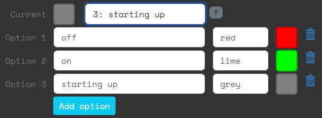

# Status lights
A status light is a layer that is used to represent something in the real world that can be influence by the hackers in Attack Vector.

## Status light options
When you create a status light layer in the editor, these are the properties:

## Options
The middle section shows you the options that status light can have and the  current option. You can change the current option from here.

Each option has a color and an (option) text. The color is defined as a css color. This means that you can enter either a fixed color, as defined [here](https://developer.mozilla.org/en-US/docs/Web/CSS/Reference/Values/named-color). Or you can enter a hex value, such as: `#345` or `#ffd700`.

You can add and remove options, the minimum number of options is two.

## Switch and Widget
In the world of the players, there are two things that represent the status light:

- Widget: this is where players can see the status light, what state it is in.
- Switch: this is where hackers (or players) can change the state.

In the status light properties, there are two URLs that can be used to access them:

### Widget
You can show the value of the status light with a separate phone or laptop. For the purpose of explanation we'll assume you are using a phone.

Open a browser on the phone and go to the URL of the widget. This will show the current status:

 OR 

### Switch
When the players hack the status light layer, they will access the switch. A new browser tab will open, looking like this:

The text "Security camera" is the label of the switch. It is only visible on the switch itself. It can be different from the name of the layer.

As a game master you can also open the switch URL directly to see how it works.

Alternatively, you can also give some players direct access to the switch. These players don't have to be hackers. More details [here](#direct-access-to-the-switch).

## Three or more options
When a status light has three or more options, the interfaces change slightly.

Suppose you add an option 'starting up':

Then the switch will look like this:

## Use cases
There are many ways to use the status light in your Larp.

You can put a phone next to a door and tell the players that the door is locked when the phone shows a red light.

You can integrate the phone into a prop for the life support system. If the players flip the switch, the life support system will become red and indicate to the players that they will be running out of oxygen.

You don't have to show the status light widget in the real world. If you are watching them hack, you can just have the world react the players flipping the switch.

## Status light layer types in the editor
In the site editor there are two icons for this layer type: 

The first creates a status light that has been set up as a lock. The text for red is `locked` and the text for green is `unlocked`.

The second creates a generic status light. he text for red is `off` and the text for green is `on`. 

There is no further difference between those two. And you can always change the text and colors as you see fit.

## QR codes
If you click on the **QR** button a popup will open with a QR code. You can scan this code with a phone to directly open the page.

The Copy and Download buttons are for convenience, for if you want to use the QR code image somewhere else.

## Direct access to the switch
You can give players direct access to the switch by giving them the URL or the QR code. This works as described in the standalone section, see [here](/gm/standalone/Standalone%20apps).

It's possible to combine the standalone aspect of switches with allowing hackers to reach it via the site.

If you add ICE layer(s) to protect the switch, they will also protect the standalone link to it. And if the ICE is hacked (or the password entered for password ICE), it will be hacked for both the site and the standalone link.

