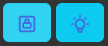
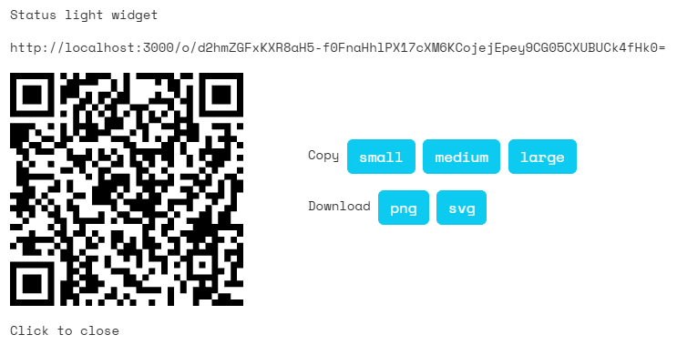

# Status lights
A status light is a layer that is used to represent something in the real world that can be influence by the hackers in Attack Vector. In the real world you have to show the value of the status light with a separate phone or laptop. For the purpose of explanation we'll assume you are using a phone.

## Switch and widget
When you create a status light layer, there are two URLs

**Switch**: this is the URL of the switch.

**Widget**: this is the URL that displays the status.

Open a browser on the phone and go to the URL of the widget. This will show that the status light is currently off:

What the players will see when they hack the status light layer, is the switch. Currently it looks like this:

If the players (or you) flip the switch, the phone will show:

And the switch will look like:

You can go to the switch URL yourself and try it out.

## Use cases
There are many ways to use the status light in your Larp.

You can put a phone next to a door and tell the players that the door is locked when the phone shows a red light.

You can integrate the phone into a prop for the life support system. If the players flip the switch, the life support system will become red and indicate to the players that they will be running out of oxygen.,

## Status light layers in the editor
In the site editor there are two icons for this layer type: 

The first creates a status light that has been set up as a lock. The text for red is `locked` and the text for green is `unlocked`.

The second creates a generic status light. he text for red is `off` and the text for green is `on`. 

There is no further difference between those two. And you can always change the text for red and green as fits your use case.

## QR codes
If you click on the **QR** button a popup will open with a QR code. You can scan this code with a phone to directly open the page.

This can be a convenient way to open the URL on the widget phone.

You *can* access the switch via the switch URL optionally using a phone for this and using that QR code. This is intended for standalone use, more details [here](/gm/standalone/Standalone%20apps).

## Direct access to the switch
You can give players direct access to the switch by giving them the URL or the QR code. This works as described in the standalone section, see [here](/gm/standalone/Standalone%20apps).

It's possible to combine the standalone aspect of switches with allowing hackers to reach it via the site.

If you add ICE layer(s) to protect the switch, they will also protect the standalone link to it. And if the ICE is hacked (or the password entered for password ICE), it will be hacked for both the site and the standalone link.

