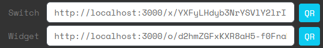

# Standalone apps
It's possible to allow players to interact with Attack Vector without having to enter a site. For this they need to find an URL that they can enter into their laptop (or in some cases their phone).

This will allow the players to start hacking ICE directly, without the trouble of having to type in commands in a terminal.

You can also use this to give them access to a switch that they can use to change the status of a status light. (Details [here](/gm/sites/basic/Status%20lights)). The switch can optionally be protected by a password or an ICE puzzle.

Note that players will need to log into Attack Vector, so they will need to have an account.

## Standalone ICE
Create a site that contains one node and add the ICE layer.
In the editor copy the Standalone URL:


Have the players find this URL in the game. When they access this URL, they go directly to the ICE puzzle.

Once they solve the puzzle, they will see the following:
```
ICE grants access. 
↼ No underlying layers can be accessed. (You can close this tab)
```

So you as GM have to be present to tell them the effect of hacking this ICE.

## Standalone switch
Create a site that contains a status light layer. 

```
0. OS
1. Status light
```
In the editor copy the Switch URL:



Have the players find this URL in the game. When they access this URL, they go directly to the switch page. This page can be access with a mobile phone. So you can also use the QR code of the Switch URL instead.

## Switch protected by password ICE
Create a site that contains a status light layer, and above that, put a password ICE layer.

```
0. OS
1. Status light
2. Password ICE
```

If the players access the URL of the switch, they will be shown a password entry screen. This is similar to the password ICE puzzle layer, except that this is more of a normal password interface, rather than a hacker's view.


Players can switch to the hacker version of the password ICE screen by clicking 3 times on the word ICE.

Once they enter the correct password, they will see the switch.

Note that if the password is entered correctly, the ICE is considered hacked, and anyone with the URL will now directly go to the switch. If you want to activate the password again, you need to reset the site.

## Switch protected by other ICE
Create a site that contains a status light layer, and above that, put a (non-password) ICE layer.

```
0. OS
1. Status light
2. ICE
```

If the players access the Switch standalone URL, they will be shown a variation of the password interface:


The difference is that this screen asks for a **passcode** that has the form `type/xx-xx-xx-xx/xx-xx-xx-xx/`. This is because only temporary passwords work on non-password ice. See [here](/gm/sites/basic/Passwords%20and%20keystores) for details on temporary passwords and keystores.

The players can access the normal ICE hacking puzzle screen by clicking 3 times on the word ICE.

Alternatively you can immediately make the standalone ICE URL available to the players. This directly shows them the ICE hacking screen.

Once the players have hacked the ICE, they will be shown the switch.


## Multiple ICE layers
It's possible to add multiple ICE layers on top of each other. This way the players will be forced to solve multiple ICE puzzles, enter multiple passwords or a combination of the two.

Every time the players hack a layer of ICE they will be redirected to the next highest non-hacked layers of ICE in the node. If there are no more ICE layers, they will be redirected to the switch if that is present in the node.
