# Example hacking run
This page provides an example hacking run to give you an idea of what it might look like to use Attack Vector. This is a very minimal run that introduces only the most basic components and actions.

## In-game situation
You are a hacker-for-hire. You are hired to hack the site of a criminal organization to learn which politician they have bribed. Through some inquiry, you have learned that the name of their site is 'agora-syndicate'.

## Entering the site
When you log into attack vector, you can enter the name of the site to attack:

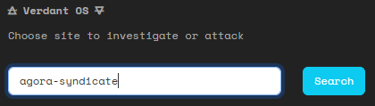

This brings you to the site overview.

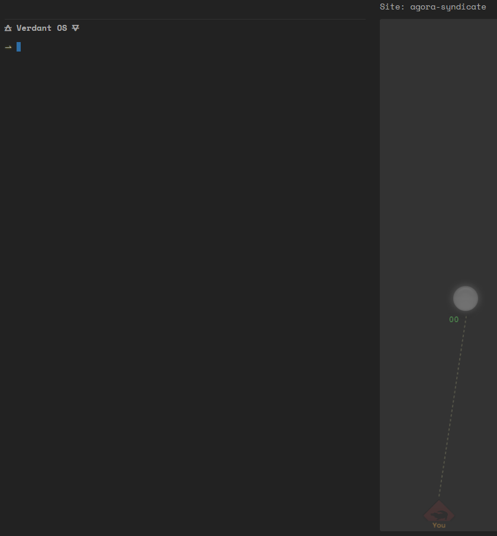

## Scanning
The first thing do is to scan this site by typing `scan`. This reveals parts of the site that are not protected by ICE.

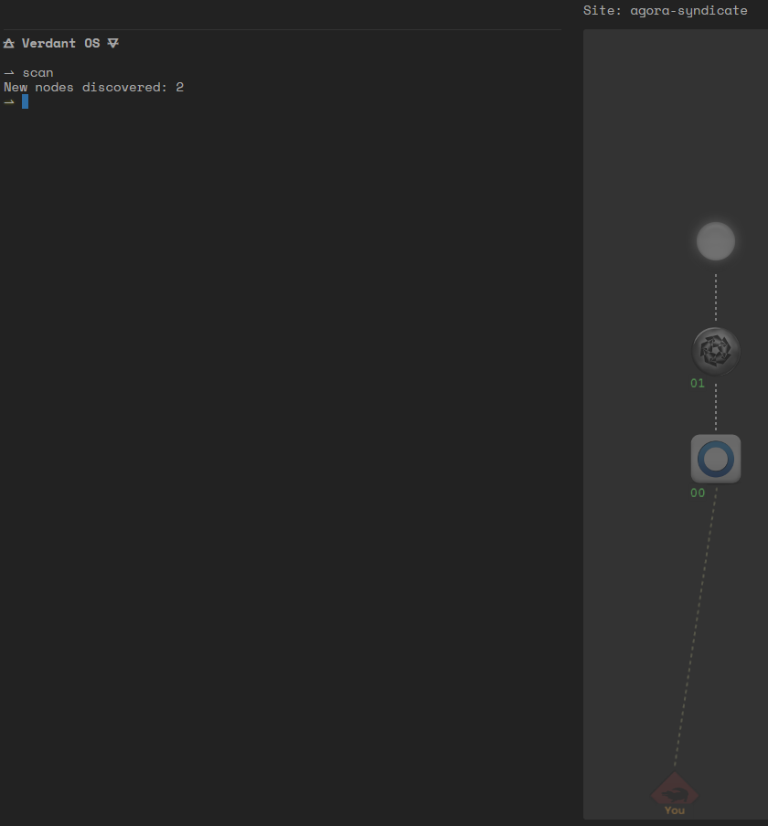

So the site consists of at least 3 nodes, with the second node contains ICE.

Just to be sure, you examine the nodes by clicking them:

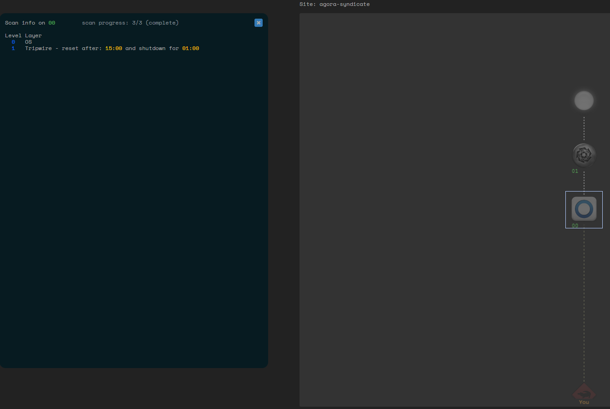

Node '00' contains a tripwire. This will put you on a timer to hack the rest of the site, until you can find a way to stop the timer.

Node '01' contains ICE that will block your progress. You will need to hack it. Fortunately enough the ice is very weak, so it should not take too much time.

## Attacking
That's all the information you can get right now, so the next thing you do is to start the attack by typing `attack`.

As expected, the tripwire triggered a timer, so you cannot delay.

On the map you can see that you have entered the site and are in node 00.

## First node
Out of habit you use the `view` command to check what layers are inside this node. But you learn nothing new as you already checked the node beforehand. Then you `hack` the tripwire layer.

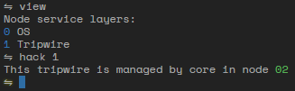

The good news is that this tripwire is linked to a core layer. If you hack that core layer, then the timer will be reset. The core layer is located in node '02', but currently you don't see this node. So it must be somewhere behind the node with the ICE.

Bbetter get moving and head deeper inside the site with the `move` command.

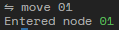

## Second node
This is the node with the ICE. Just to remind you which layer it is in, you use the view command, and then quickly run the `hack` command on that layer.

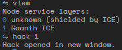
This opens the hack view in a new window.

## Hacking ICE
Your ICE hacking software automatically identifies the type of ICE and what weakness can be used to break it.

Gaanth ICE has the weakness that its encryption can be expressed as a form of tangled lines. It cannot be automatically hacked by your software, but all you have to do is to untangle the lines by dragging a the nodes.

And since this is very weak ICE, this is not much of a challenge here.

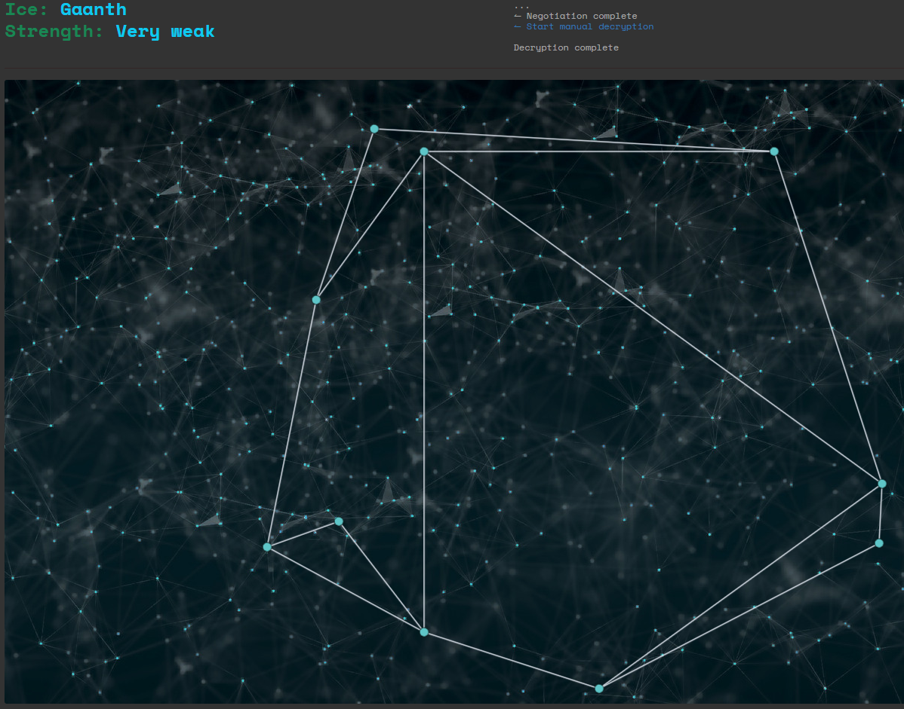

## Scanning again
The way forward is clear now, as can also been seen on the map.

You decide to `scan` the site again, now that the ICE has been removed.

This reveals a single new node. Turns out that this is a very small site indeed! On the bright side, you found the node that contains the core needed to stop the timer.

## Final node
You move to the last node with the `move` command.

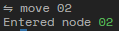

And quickly find and hack the core to stop the timer.

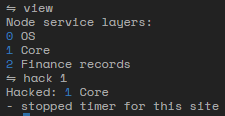

Now it's time to get what you came for. You `hack` the layer with the financial records.

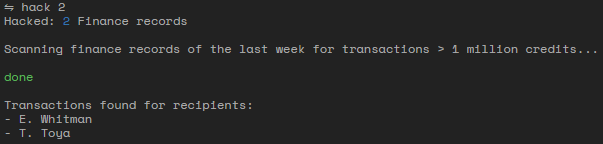

Great, so the criminals were bribing Whitman and Toya. You are sure you client will be happy to learn this.

You return to your home page of Attack Vector, thus ending your hacking run and you presence in the site.

