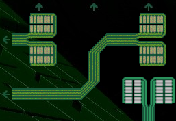

# Netwalk ICE
This ICE is called Sanrachana in game. Sanrachana is the Hindi word for `structure`.

As a hacker you are reconfiguring a network that has been purposefully obfuscated to keep hackers out.

## Minigame
Netwalk ICE tasks players with connect all elements to the center. Click on an element to rotate it.

Netwalk ICE of strength 'Very strong' or 'Onxy' uses wrapping. This means that the elements from the border rows connect to elements on the border of the opposite site. This is indicated by small green arrows.

This ICE is a version of [Simon Tatham's Net puzzle](https://www.chiark.greenend.org.uk/~sgtatham/puzzles/js/net.html).

## ICE strength
If the ICE strength is weak, then there are fewer elements.

If the ICE strength is strong, then there are more elements. If the strength is very strong or greater then the connections are wrapping around the edges of the grid.

## Multiplayer

Multiple hackers can work on the same puzzle at the same time. Coordination problems are smaller than with Tangle ICE, as each player can just start in a corner and work towards the center.