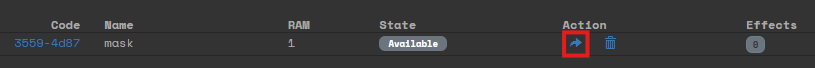
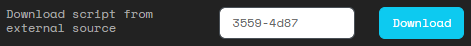

# Transferring scripts
You can transfer your script to another player.

## Offering your script for download
In the **Scripts** page you can offer your script for download by another player, by clicking the offer action:

You give that player the code of the script (here `3559-4d87`). And the receiver of the script can then go to their **Scripts** page and enter the code to download the script:

Once the script is downloaded, you will lose the script. It is not possible to make copies of a script (having multiple scripts with the same code).

## Receiving scripts from outside
It's possible that scripts can be received from other sources than your fellow players. For example an NPC vendor. In that case it works the same. You receive the script code and download it by using the code in the download section.

Remember that all scripts expire at 06:00 in the morning. So if you receive/find a script code, download _and_ use it the same day.