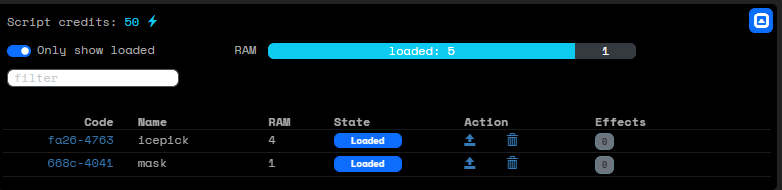

# Using scripts
While in a hacking run, you can view the scripts you have loaded. Click the script icon in the top right corner of the map, to expand the script panel.



You see the scripts that you have loaded. If you click on the code, it will be copied to the clipboard. You can then run the script using the run command, followed by the code. (You can paste the code, but you may need to give permission for this in your browser.)

```
⇋ run fa26-4763
```

Depending on the type of script, you may need to also add a layer number or another parameter. If the script does not know how to execute, you will get an error message asking for the additional information. The script will not be used up if it could not execute.

Each script can only be used once. After it is successfully used, it's state will change to `Used`. It can then be safely deleted.
