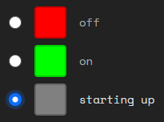

# Status light
This layer type represent something in the real world that can be changed. For example a device that can be turned on and off. Or a door that can be unlocked.

By hacking this layer you gain control over the status of the device.

```
⇋ view 
Node service layers: 
0 OS 
1 Lock 

⇋ hack 1 
Opened in new window.
```
Hacking this layer opens a new browser tab that shows the switch and you to flip it.

State off:


State on:


There can be something in the real world that shows the current state. This will be a phone or a laptop. The state shown on the phone or laptop is changed in real time when you flip the switch.

This will look like this:

 or 

## Status lights with three or more options
It's possible for a status light to have more than two options. In that case the switch will look like this:



