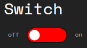
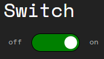
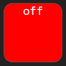
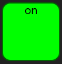

# Status light
This layer type represent something in the real world that can be turned on and off, or locked and unlocked.

By hacking this layer you can change the status of the thing, so unlocking the door, or disabling the security system.

```
⇋ view 
Node service layers: 
0 OS 
1 Lock 

⇋ hack 1 
Opened in new window.
```
Hacking this layer opens a new browser tab that shows the switch and you to flip it.





There can be something in the real world that shows the current state. This will be a phone or a laptop. The state shown on the phone or laptop is changed in real time when you flip the switch.

This will look something like this:

 

or 

