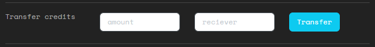

# Credits and income
If you have the 'Script credits' skill, you can view your balance on the **Credits** page. You can also view your transaction history here.

## Transferring credits
On this page there is a form where you can transfer credits to another hacker. Just fill in the hacker name as the receiver.

## Credits income
Depending on your Larp and your character, it's possible to have an income of credits that you can collect on specific dates (i.e. one or more dates during the Larp).

If today is such a date, there will be a button on this page to collect it.

If you don't collect your income on the day itself, there is no way to collect it afterwards yourself. But you can always ask a game master who can give you the credits manually.
