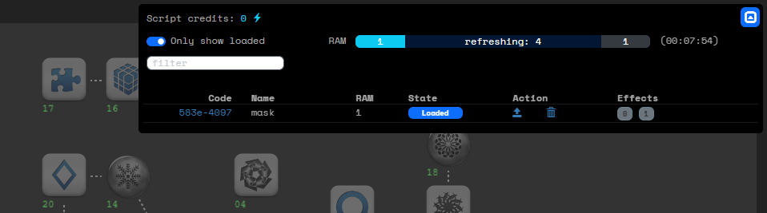
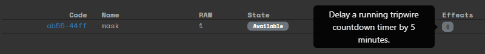
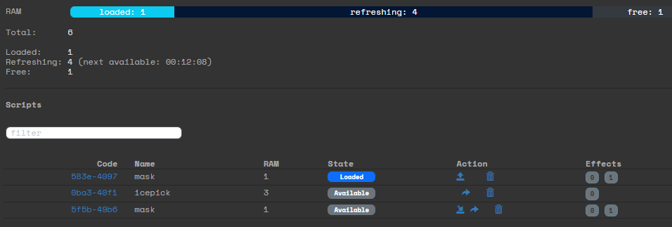

# Scripts overview

*Showing a player that is hacking a site and accessing their loaded scripts. They have one mask script loaded with id: 583e-4097.*

## Concept
Scripts are one-time-use programs that can be run during hacking runs. They can perform a variety of tasks, such as extending your time to hack or helping you break through ICE.

Thematically scripts exploit security flaws. Those flaws will be patched automatically by security systems after use, so all script can only be used once. The flaws are also patched daily at 06:00, so scripts can only be used on the day they are created.

Check out this video for a player-focused explanation of how scripts work: [Youtube](https://youtu.be/ri3hewshbKA).

## Script types

The specific scripts available in your LARP are determined by your GM. Each script may have one or more effects. When you receive a script, you can hover over its effects to see what they do.

A script can have multiple effects that are executed in order when a script is run. Some of these effects can be negative. It's also possible for a script to contain unknown effects that can only be found out by running the script.

*The 'sketchyscript' has one visible effect and some effects that are unknown. The 'withdrawbacks' script has 3 effects. The primary effect will be useful, but it also contains additional effects that are not positive, like reducing future tripwire timers.*

## RAM
To use scripts, you need the Scripts skill. This skill gives you a number of RAM blocks, which determine how many scripts you can load at once.

Each script has a RAM cost. You can only load as many scripts as will fit in your available RAM. After a script is used, its RAM blocks refresh gradually, one by one.

## Access to scripts
How you obtain scripts depends on your LARP. Possible ways include:

- Scripts granted by the GM
- A daily script allowance
- Script codes that you can find/buy in the Larp world. You can download scripts using these codes.

You can also share offer your scripts for download by other hackers and give them the codes of your scripts. But be aware: when someone downloads your script, you lose it.

## Running a script

During a hacking run, you can execute a script with the run command. For example: `run ab55-44ff`

If a script requires extra parameters, it will prompt you accordingly.

To view your available scripts during a run, click this icon  at the top-right corner of your map. If you don’t see this icon, you don't have the Scripts skill, have no RAM and cannot run any scripts.

## Scripts credits

Scripts credits (⚡) allow hackers to buy scripts from the black market.
